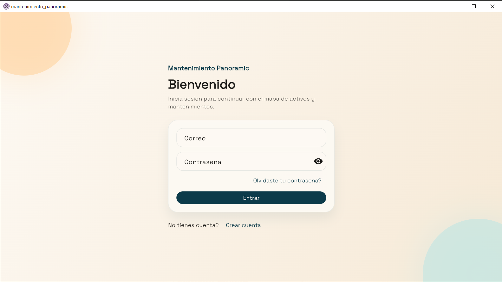
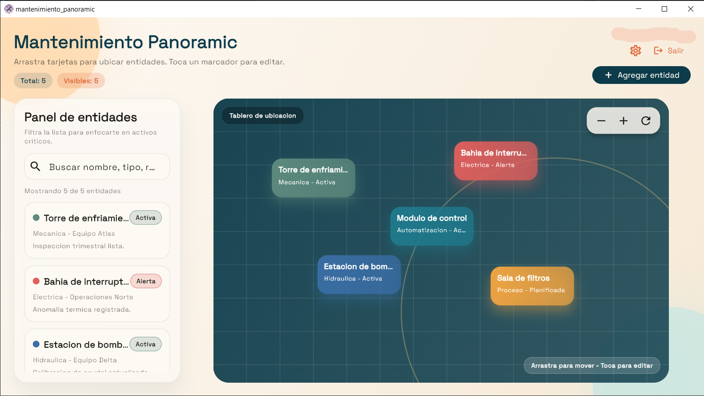
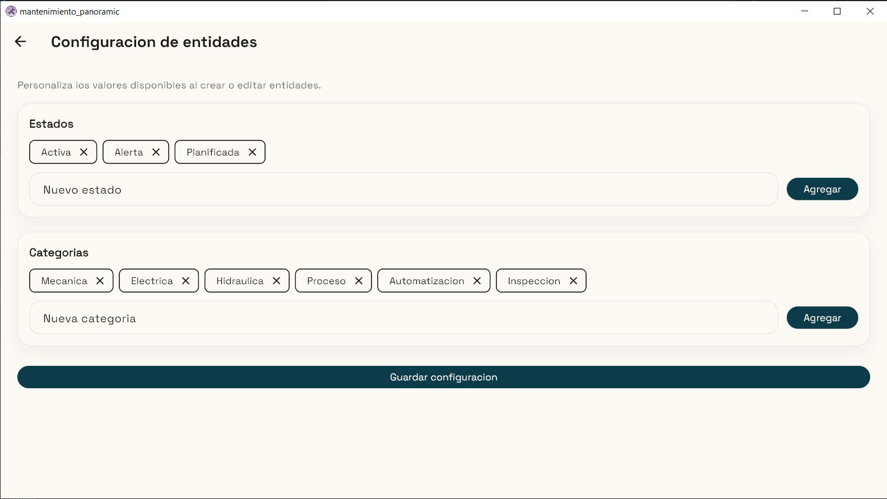

# Mantenimiento Panoramic

Panel de mantenimiento con mapa de activos, gestion de entidades y flujo de
autenticacion. Las entidades y opciones se guardan por usuario en Firestore.

## Funcionalidades
- Login, registro y recuperacion de contrasena (Firebase Auth)
- Canvas interactivo con zoom, pan y arrastre de entidades
- Editor de entidades con estado y categoria desde listas configurables
- Vista de configuracion para administrar estados y categorias
- Persistencia por usuario en Firestore

## Stack
- Flutter + Material 3
- BLoC para estado
- Firebase Auth + Cloud Firestore

## Configuracion rapida
1) Instalar dependencias
```bash
flutter pub get
```

2) Habilitar en Firebase:
- Authentication > Email/Password
- Cloud Firestore

3) Reglas recomendadas (Firestore)
```rules
rules_version = '2';
service cloud.firestore {
  match /databases/{database}/documents {
    match /users/{userId}/canvas/{docId} {
      allow read, write: if request.auth != null
        && request.auth.uid == userId;
    }
  }
}
```

4) Ejecutar
```bash
flutter run
```

## Estructura
- `lib/app`: app raiz y tema
- `lib/bloc`: estado y eventos de entidades
- `lib/data`: repositorios (Firestore)
- `lib/models`: modelos base
- `lib/ui/pages`: pantallas (auth, planner, settings)
- `lib/ui/widgets`: componentes visuales

## Capturas




